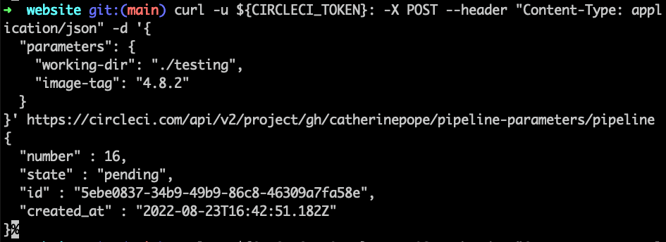

# Pipeline Parameters

In this example, the working directory and Docker image are specified by parameters passed through the API.

Here's an example:

The Docker login credentials are provided by a context. They could also be included in the Project settings.
